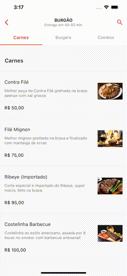

# Flutte Scroll Animated

In this example, we'll simulate the list of dishes, food items, or products within an establishment, taking inspiration from the iFood app. Our focus is on enabling programmatic scrolling that allows users to navigate to categories initially not visible on the screen.

Moreover, as users scroll through the list, we'll implement a listener that automatically changes the active tab. This will provide a more dynamic and intuitive experience for users. We aim to demonstrate how to create this feature to enhance usability and interaction with the item list in the app.

